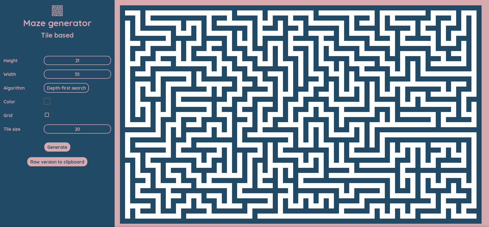

# daedal
Maze generation algorithms written in pure JavaScript.  

  

Generate perfect mazes (_tile-based_) with some rendering options.    
"Perfect" means there is exactly one path to any other point from each point.

### Algorithms:
- Depth-first search
- Recursive Division
- Prim (randomized)
- Hunt-and-kill
- Binary Tree
- Growing Tree
