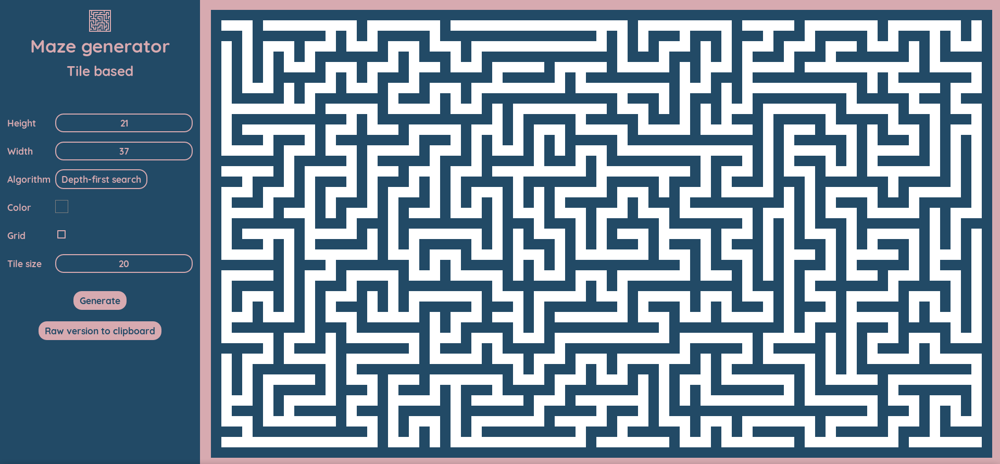

# daedal
Maze generation algorithms written in pure JavaScript.  

  

Generate perfect mazes (_tile-based_) with some rendering options.    
"Perfect" means there is exactly one path to any other point from each point.  

The project is based on [Node.js](https://nodejs.org/fr/) and [Webpack 4](https://webpack.js.org/).

### Algorithms:
- Depth-first search
- Recursive Division
- Prim (randomized)
- Hunt-and-kill
- Binary Tree
- Growing Tree

### Requirements
The only thing required is [Node.js](https://nodejs.org/fr/).

### Usage
| Commands   | Description |  
|-------------|---------------------------------------|  
| `npm install` | Install project dependencies          |
| `npm start`   | Build project and run (open) web server (available at http://localhost:8080) |  
| `npm run build`   | Build project for production (see the generated 'dist' folder) | 