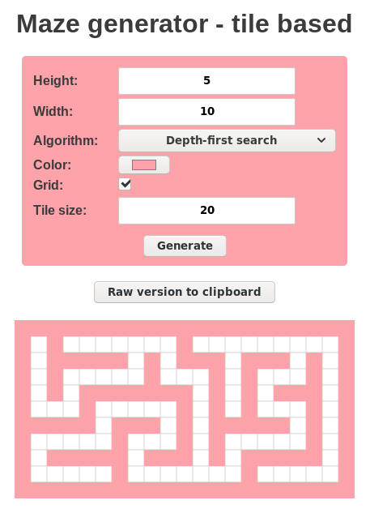

# daedal
Maze generation algorithms written in JavaScript.  

Generate perfect mazes (_tile-based_) with some rendering options.    
"Perfect" means there is exactly one path to any other point from each point.

### Algorithms:
- Depth-first search
- Prim (randomized)
- Hunt-and-kill
- Binary Tree (North/West bias)

  
